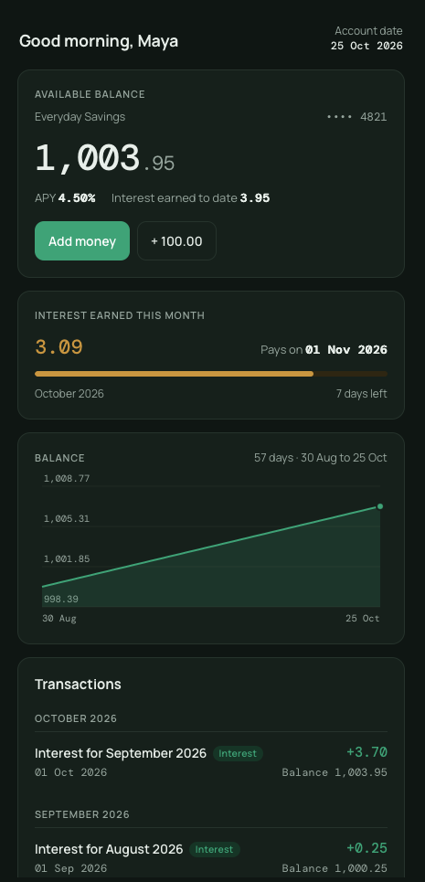
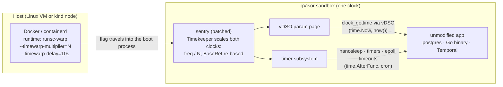
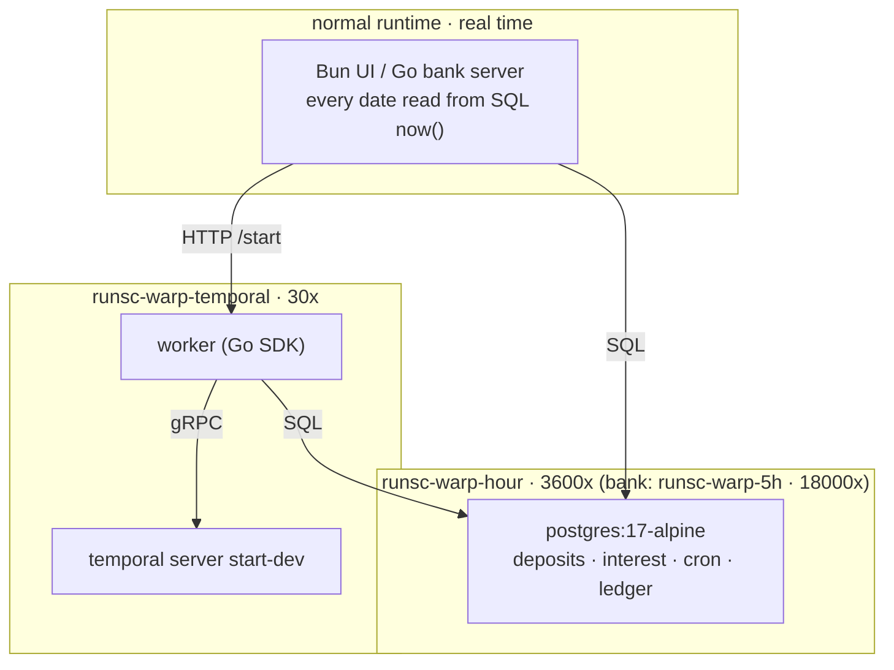

# timewarp-gvisor

Make time run fast inside a container without changing the image. A patch to
gVisor's userspace kernel (the sentry) scales the clocks the sandbox sees, so an
unmodified Postgres, or a static Go binary, believes a day passes every second.

Research prototype. It disables real time inside the sandbox, so do not run it
in production. Apache-2.0, same as gVisor.

## What it does

Start a container with `--timewarp-multiplier=3600` and every clock read inside
it runs 3600 times faster than the host. `time.Now()`, `clock_gettime`,
`now()` in SQL, sleeps, timers, cron schedules. They all move together, because
the sentry owns all of them.

Measured results, all with zero changes to the workload:

- A Go program's `time.AfterFunc(2h)` fired after 8 real seconds at 1000x.
- Upstream `postgres:17-alpine`: a 90-day term deposit matured in 91 real seconds
  at 86400x, on Kubernetes, off plain `now()`.
- The same Postgres at 3600x runs the demo UI below: daily interest, rollovers,
  and hourly cron jobs, one simulated hour per real second.
- A small bank at 18000x (5 simulated hours per real second): one savings
  account, daily interest accrual, one ledger posting per month. Nothing in the
  bank knows about the warp; the month closes every 2.5 real minutes.
- An unmodified Temporal dev server plus a Go worker at 30x: an activity with
  exponential retry backoff (1m, 2m, 4m, 8m) completes in 31 real seconds.
  30x is where Temporal's own internal deadlines stop coping; details in
  `docs/temporal-plan.md`.


The bank, from the customer's side (`stack/bank`, `docs/bank-plan.md`):



## How it works



The multiplier arrives through a real `runsc` flag, because that is the only
channel that reaches the sentry: it gets a clean environment and a restricted
mount namespace, so env vars and host files never arrive. For the first
`--timewarp-delay` seconds the clocks run at 1x so services with start-up
deadlines can come up; after that the switch to `N` is continuous.

The demos keep the warped things behind one clock and let only plain SQL or
HTTP cross into real time. gRPC never crosses, because its deadline header is
read on the receiver's clock:



## Why gVisor

## Quick start

`runsc` runs on Linux only. On macOS everything happens inside a Lima VM
(Ubuntu, Apple Virtualization.framework, no nested virt). The repo is mounted at
the same path inside the VM.

```bash
limactl start --name=gvisor ./lima/gvisor.yaml
limactl shell gvisor

# once: build the patched runsc and register it as Docker runtimes
./gvisor/build-runsc.sh           # go build ./runsc on a patched module tree, no bazel
./gvisor/install-runtimes.sh      # runsc-warp (1000x), runsc-warp-hour (3600x), runsc-warp-fast (86400x)

# the smallest proof: an unmodified Go binary, 1h timer at 1000x
TIMER=1h RATE=1000 ./gvisor/run-victim.sh

# the demo stack: Postgres at 3600x, Temporal + worker at 30x, a UI on the normal runtime
bash stack/up.sh                                  # http://localhost:8080 on the host
CONTAINER=pg TERM_DAYS=2 scripts/e2e-maturity.sh  # 2 simulated days mature in ~50 s
CONTAINER=pg scripts/e2e-temporal.sh              # 4 retries with exponential backoff in ~30 s
docker rm -f pg twui temporal worker

# the bank: Postgres at 18000x, a Go server on the normal runtime
bash stack/bank/up.sh                             # http://localhost:8090
CONTAINER=bankpg scripts/e2e-bank.sh              # waits for the monthly interest posting
docker rm -f bank bankpg
```

The rate is fixed when a sandbox boots. `install-runtimes.sh` writes one Docker
runtime per multiplier into `/etc/docker/daemon.json`; pick the rate by picking
the runtime. Every runtime also has `--timewarp-delay=10s`: the clocks run at 1x
for the first 10 seconds so services with start-up deadlines can come up.

## On Kubernetes

`k8s-lab/` does the same on a kind cluster. It copies `runsc-warp` and the gVisor
containerd shim into the kind nodes, adds a containerd runtime handler whose
`runsc.toml` carries the multiplier, registers a `RuntimeClass`, and runs the
Postgres pod on it. The UI runs on the normal runtime next to it.

```bash
kind create cluster --name timewarp
limactl shell gvisor -- bash "$PWD/k8s-lab/build-warp-runtime.sh"
limactl cp -r gvisor:~/k8s-lab-bin/. k8s-lab/bin/
KIND_CLUSTER_NAME=timewarp MULTIPLIER=3600 ./k8s-lab/inject-warp-runtime.sh
KIND_CLUSTER_NAME=timewarp ./k8s-lab/deploy-stack.sh
NS=timewarp DEPLOY=postgres TERM_DAYS=2 scripts/e2e-maturity.sh
NS=timewarp DEPLOY=postgres scripts/e2e-temporal.sh
kubectl port-forward -n timewarp svc/twui 8080:3000   # the UI pod is not sandboxed, so this works
```

Three things bit me there and are worth knowing before you try your own
workload. Readiness probes must be `tcpSocket` or `httpGet`, because an `exec`
probe runs inside the sandbox where its 3-second timeout is 35 microseconds
real. Postgres drops the odd connection at high rates, since its own
`authentication_timeout` fires in warped time. And `kubectl port-forward`
cannot reach a gVisor pod at all; use `kubectl exec`. `k8s-lab/README.md` lists
the rest.

The lab is deliberately a single Postgres pod. Anything with inter-node clock
agreement (a distributed database, a gRPC mesh with deadlines) breaks until
sandboxes can share one anchor. See the roadmap.

## Layout

| Path | What |
|---|---|
| `gvisor/clockwarp.patch` | The sentry patch, pinned to gVisor `release-20260622.0`. CI checks it still applies. |
| `gvisor/apply-clockwarp.py` | Regenerates the patch by matching source anchors after a gVisor bump. |
| `gvisor/build-runsc.sh`, `install-runtimes.sh`, `run-victim.sh` | Build, register, run. Linux. |
| `gvisor/PATCH.md` | Design notes and the refresh procedure for a new gVisor tag. |
| `victim/` | A plain Go program that prints wall clock and elapsed time and arms a timer. |
| `stack/` | The Docker demo: `schema-native.sql`, `up.sh`, the Bun UI in `stack/ui/`, the Temporal worker in `stack/worker/`. |
| `stack/bank/` | The bank: one Go binary (API, embedded frontend, interest engine), `bank.sql`, `up.sh`. |
| `k8s-lab/` | The kind lab: build, inject, `postgres.yaml`, `temporal.yaml`, `worker.yaml`, `ui.yaml`, `deploy-stack.sh`, runbook. |
| `scripts/e2e-maturity.sh`, `e2e-temporal.sh`, `e2e-bank.sh` | The e2e tests. Each runs against Docker (`CONTAINER=`) or Kubernetes (`NS=`, `DEPLOY=`). |
| `scripts/smoke-test.sh`, `smoke-temporal.sh` | Real images under plain `runsc`, and the Temporal server at each multiplier. |
| `docs/temporal-plan.md` | Plan and findings for Temporal on the warped clock, including the 30x ceiling. |
| `authority/` | An HTTP service holding `(anchorReal, anchorVirtual, multiplier)`. Builds and runs, but nothing reads it yet. |
| `lima/gvisor.yaml` | The VM. |

## Status and roadmap

Done: the per-sandbox warp, verified on Docker and Kubernetes, pinned to a
gVisor tag, with CI that fails when upstream drift breaks the patch.

Not done, in the order I would do it:

1. Live rate changes. A `runsc timewarp <id> --rate N` control method so the
   multiplier can change on a running sandbox. The calibration loop already
   republishes the clocks every second, so it would pick a new value up on the
   next cycle.
2. A shared anchor. A `--timewarp-anchor` flag so several sandboxes agree on the
   wall clock instead of each drifting from its own boot time. This is what
   distributed workloads need.
3. Wire `authority/` in, so the rate and anchor come from one service rather than
   from a flag in `daemon.json`.
4. A prebuilt `runsc-warp` release, so the first run does not need a 5-minute
   build.

Also open: why Temporal tops out at 30x. Its internal deadlines are single-digit
seconds, which at 1000x is single-digit real milliseconds against real SQLite
and gRPC latency. Fixing that means either raising those timeouts through
dynamic config or accepting the ceiling.

## License

Apache-2.0, see `LICENSE`.
