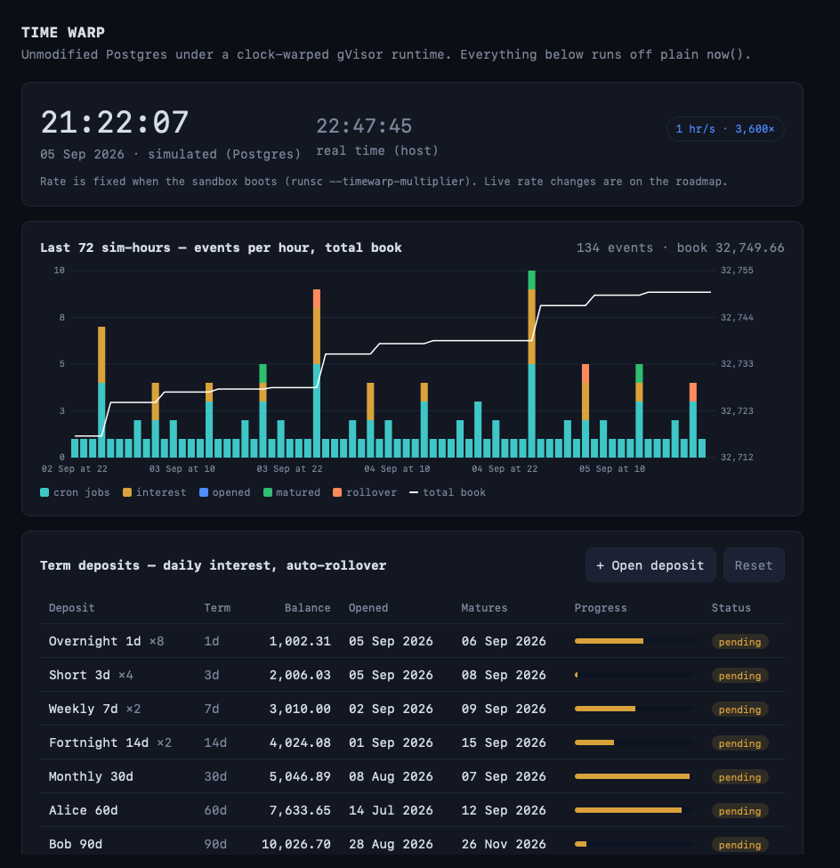

# timewarp-gvisor

A prototype of the "spin up a group of containers with one controllable clock"
idea, built on **gVisor**. The goal: warp time for *unmodified* images — including
Go binaries like Temporal — with no code changes, by owning time one layer down,
in gVisor's userspace kernel (the sentry).

This is the transparent counterpart to the cooperative `sim_now()` demo
(`../timewarp-demo`). Same three-number clock; here the sandbox inherits it
instead of the application reading it explicitly.

> **Scope:** a research prototype for *accelerating* time in tests — running a
> real stack at, say, one simulated day per real second to exercise scheduler,
> expiry, retention, and maturity logic without waiting. It modifies gVisor's
> clocks at build time; it is **not for production**, and the warp is set per
> sandbox at boot (live, group-wide rate control is on the roadmap below).
> Licensed Apache-2.0, matching gVisor.

## Why gVisor (and not Kata / libfaketime)

- **libfaketime** intercepts libc time — but Go reads the clock via the vDSO,
  bypassing libc, so it can't be warped this way.
- **Kata** gives each pod its own kernel/clock, but needs KVM/nested virtualization
  (not available through Docker Desktop on Apple Silicon).
- **gVisor** is a userspace kernel. Its `systrap`/`ptrace` platform needs **no
  nested virtualization**, and it *provides* the vDSO and *runs* the timer
  subsystem for the sandbox — so it can warp wall-clock reads, monotonic reads,
  and sleeps/timers together, for any image. That's why it's the realistic
  foundation to prototype here.

## Components

| Dir | What | Status |
|-----|------|--------|
| `gvisor/clockwarp.patch` | The sentry patch (pinned to `release-20260622.0`): scales both clocks, adds the `--timewarp-multiplier` flag. CI checks it still applies. | **Works** |
| `gvisor/apply-clockwarp.py` | Generates/re-ports `clockwarp.patch` by matching source anchors when a gVisor bump moves things. | **Works** |
| `victim/` | An ordinary, time-warp-unaware Go program: prints wall clock + elapsed, arms a timer. The thing we warp. | **Builds & runs** |
| `gvisor/build-runsc.sh` | Fetch gVisor, apply patch, build `runsc-warp`. Linux. | Script |
| `gvisor/run-victim.sh` | Run the victim under the warped `runsc` at a chosen rate. Linux. | Script |
| `gvisor/PATCH.md` | Design notes: touch-points, transform, the multiplier-channel lesson. | Doc |
| `authority/` | Clock control-plane *design*: holds `(anchorReal, anchorVirtual, multiplier)`, serves `/now`, `/params`, `/rate`, `/reset`. | Builds & runs; **not yet wired to the sentry** (roadmap) |

## PROVEN (2026-06-16)

The patched `runsc` warps an **unmodified** static Go binary. Under
`--timewarp-multiplier=1000`, the victim's `time.AfterFunc(2h)` fired in **8 real
seconds** and `time.Now()` jumped ~2 hours — zero code changes. This is the
transparent warp libfaketime cannot do (Go bypasses libc via the vDSO).

Build + run (inside the Lima VM, no bazel — see `PATCH.md` for why the module
tree is used):

```bash
./gvisor/build-runsc.sh           # fetch gVisor, apply clockwarp.patch, build runsc-warp
RATE=1000 ./gvisor/run-victim.sh  # run the unmodified victim at 1000x
./gvisor/install-runtimes.sh      # register runsc-warp{,-hour,-fast} as Docker runtimes
```

`build-runsc.sh` applies the committed `clockwarp.patch` (pinned to
`release-20260622.0`) and falls back to `apply-clockwarp.py` if the snapshot has
drifted. Under the hood it is just `go build ./runsc` on a patched module tree.

The multiplier reaches the sentry via the runsc flag (config -> ToFlags -> boot
process). Env vars and host files do NOT reach the sentry (clean env + restricted
mount namespace) — that was the key lesson.

## What works today (runnable on macOS)

```bash
./scripts/demo.sh
```

Starts the authority and runs the victim **normally** (real time) — the "before".
Then bumps the authority to 1000× and shows the virtual clock the sentry would
serve. This proves the control plane and the workload; it does not warp the victim
yet (that needs the patched runsc).

## Running real images under gVisor (Lima)

`runsc` is Linux-only, so the build/run happens in a Linux guest. `lima/gvisor.yaml`
provisions an Ubuntu VM (Apple Virtualization.framework, no nested virt) with
Docker + gVisor registered as the `runsc` runtime.

```bash
limactl start --name=gvisor ./lima/gvisor.yaml
limactl cp scripts/smoke-test.sh gvisor:/tmp/smoke-test.sh
limactl shell gvisor -- bash /tmp/smoke-test.sh
```

`scripts/smoke-test.sh` is the go/no-go: it runs the previous stack's real images
(`postgres`, the Temporal Go binary, `bun`) under `--runtime=runsc` and checks each
actually works under gVisor — before any sentry patching. Tear down with
`limactl delete -f gvisor`.

## Demo stack: unmodified Postgres at 1 hour per second (Lima)

`stack/` runs upstream `postgres:17-alpine` under the `runsc-warp-hour` runtime
(3600x) and a small Bun API + UI on the normal runtime that reads the warped
`now()`. Term deposits accrue daily interest, mature and roll over; sim-time cron
jobs fire; a live chart shows events per simulated hour.



```bash
limactl shell gvisor                # inside the VM, repo is mounted at the same path
./gvisor/build-runsc.sh && ./gvisor/install-runtimes.sh   # once
bash stack/up.sh                    # then open http://localhost:8080 on the host
CONTAINER=pg TERM_DAYS=2 scripts/e2e-maturity.sh   # 2 sim days mature in ~48 s
docker rm -f pg twui                # tear down
```

The rate is fixed when the sandbox boots (`--timewarp-multiplier` in
`/etc/docker/daemon.json`, written by `install-runtimes.sh`). The `sim_clock`
row in Postgres only mirrors that number for the UI label; the warp itself
comes from gVisor.

## Warping a Kubernetes workload (KinD)

`k8s-lab/` runs the warp on a real workload inside a KinD cluster (verified on
a fresh `kind` cluster, containerd 2.2): it installs `runsc-warp` as a containerd RuntimeClass on the kind nodes
and moves the local-dev **Postgres** pod onto it, so a 90-day term deposit matures
in ~90 real seconds off plain `now()`. `k8s-lab/deploy-stack.sh` also runs the
full `stack/` demo (seeded Postgres + UI) on the cluster. See `k8s-lab/README.md` for the runbook and
why this is scoped to single-pod Postgres (distributed DBs and the gRPC mesh need
the group-anchor work first).

## Roadmap

The static, per-sandbox warp is done and pinned. What turns this from a working
warp into the "group with one controllable clock" idea:

1. **Live rate control.** Add a `runsc timewarp <id> --rate N` URPC method
   (`runsc/boot/controller.go`) so the multiplier can change on a running sandbox;
   the next calibration cycle (~1s) picks it up. See PATCH.md.
2. **Group anchor.** A `--timewarp-anchor` flag so several sandboxes share one
   virtual epoch and their wall clocks *agree* at high multipliers, not just each
   drifting from its own boot time.
3. **Wire the authority in.** Have the control plane in `authority/` actually feed
   the triple to the sandboxes (today it serves the design but nothing reads it).
4. **Prebuilt artifact.** Ship a `runsc-warp` release binary so the first run
   doesn't require a from-source build.

Honest status: the transparent warp is real, verified, pinned, and CI-guarded
against patch drift. The remaining work is the control plane around it.

## License

Apache-2.0 (see `LICENSE`), matching gVisor. This is a research prototype that
disables real time inside the sandbox — do not run it in production.
